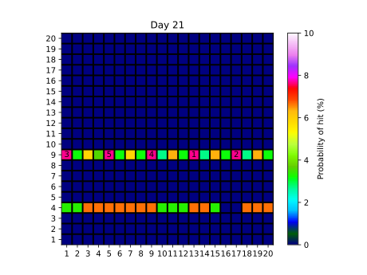

# mscroggs-advent-2022

:warning: This repository contains puzzle solution spoilers! :warning:

The code I used to help me work out drone locations for the [mscroggs 2022 advent calendar](https://www.mscroggs.co.uk/blog/97)

Example output:
